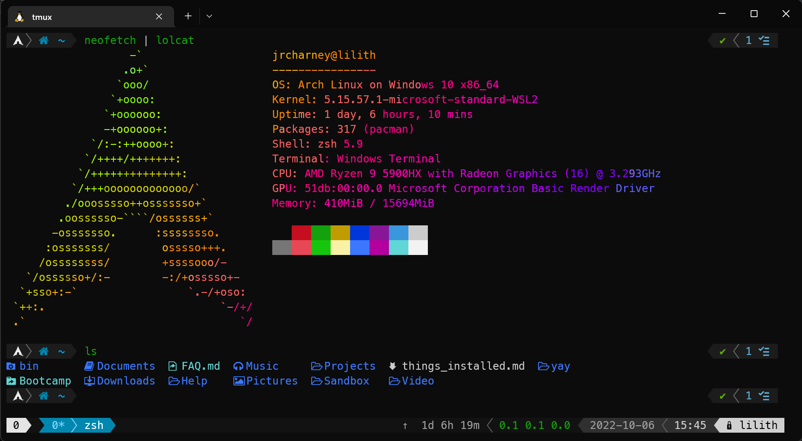

# ArchWSL++

**Welcome to the ArchWSL++!**  In this tutorial, you will be able to install Arch Linux in Windows Subshell for Linux using [ArchWSL](https://github.com/yuk7/ArchWSL).  In addition, some great aesthetic and functional features that most people should know about.

For novice users, using Linux might seem like information overload, however, this tutorial is designed to make it more user friendly.  If you have about a couple of hours (maybe less) to spare, you can make using WSL so much more enjoyable and leverage its features to help you be more productive.

For experineced users, consider this a recap of everything you should probably do to quickly get up and running.

I've decided to break this tutorial in smaller parts. The parts numbered and in a sequence, with four smaller parts.

## Part 1: The Windows Part

> Almost all of the Windows part is done in Powershell.

1. [How to set up Arch Linux for WSL](Part1/01-SetupArchWSL.md) - Start Here
2. [Get a Windows Software Installer](Part1/02-GetScoop.md)
3. [Get the NerdFonts](Part1/03-GetNerdFonts.md)
4. [Install ArchWSL](Part1/04-InstallArchWSL.md)

## Part 2: The Linux Part

> Almost all of the Linux part is done in Bash or Zsh.

1. [Set up Arch Linux](Part2/01-SetupArchLinux.md) - Note: SSH, Git and Github are installed this part. How to use it, will be in Part 3.
2. [A Trip to the Toy Box](Part2/02-ToysAndTools.md) - The fun parts
3. [Zsh and Tmux](Part2/03-ZshAndTmux.md) - A better shell experience
4. [Taskwarrior](Part2/04-Taskwarrior.md) (optional, but recommended) Use Taskwarrior, Timewarrior, and Taskell to manage time on projects.

## Part 3: The Node and Git Part

1. [Node.js and NPM](Part3/01-NodeAndNPM.md) - This also include Node Version Manager (NVM)
2. [Secure Shell](Part3/02-SSH.md)
3. [Git and Github](Part3/03-GitAndGithub.md) - We installed this eariler, but it is work taking about here.
4. [Using WSL with VSCode](Part3/04-WSLAndVSCode.md) - Putting it all together!

## Part 4. More

> Note: At this point, the pages don't really have a sequence, but I'll number them anyway.  This is exactly why I proposed using Taskwarrior, Timewarrior, and Taskell when setting up this environment.

1. [Gitlab and Redis](Part4/01-GitlabAndRedis.md) - This section would have been just Gitlab, but Redis tagged along.

### Future features here

> Note: These haven't been created yet, but they could be in the future.

- [Learning Resources](Part4/02-LearningResources.md) - Theres a lit of places to learn stuff. This page should list them.
- [Using Yarn](Part4/03-Yarn.md)
- [Test Driven Development](Part4/04-TDD.md) - Node has some pretty good tools to do Test Driven Development
- [Emmet](Part4/05-Emmet.md) - Quick shorthand commands for HTML and CSS.
- [Linting](Part4/06-Linting.md) - Not so much a program but a story about where code linting came from. More than likely we'll use ESLint, Stylelint, and Prettier unless we need to use something else.
- Vim - Vi Improved can be accessed anywhere there is a terminal, even over SSH.
- Neovim and Lua - Neovim is the next generation of Vim but uses Lua instead of VimScript.
- Cheat.sh - On-Demand cheatsheets with integration into most text editors and IDEs.
- Vim Plugins - A list of favorite Vim plugins that should work in Vim and NeoVim.
- Docker - I barely know how to use this. It might not even be in this repo espeically since I didn't set up this project with it to begin with. I probably should have.

#### Web Development

- HTML
- CSS
- JavaScript
- SVG
- Markdown
- HTML Canvas - Draw pictures using HTML and JavaScript
- LaTeX - Math formatting, a lot of Markdown editors can render this with MathJax.
- Mermaid - A JavaScript library that can generate UML diagrams, flow charts, and other visual in Markdown

#### Other things I might look into

- Express.js - Just about every Node.js project that does something with making a mock website will use this.
- Python's `http.server` - a simple way to use `localhost` to simulate a website. Not recommended for production, only development.
- Socket.io
- Redis - I've already made a couple of mentions of it, but if I write something about it, it will be defintely be about this.  Redis is a favorite NoSQL software for Ruby developers and also Node.js developers. Relies on key-value pairs.
- MongoDB - Part of the MEAN and MERN stacks, but it's a bit "chonky" for a NoSQL software. There's a reason Arch stuck this in the AUR.
- MySQL - A common open-source Relational Database Management Software (RDBMS), but fell from grace when it was purchased by Oracle
- MariaDB - MySQL's replacement. It's actually a fork of MySQL.
- PostgreSQL - Better than MySQL. Considered an "object oriented" RDBMS.
- Object-Relational Mapping (ORM) - There's several ORM frameworks. Sequelize, Prisma, Node-Postgres, Redis OM. We'll probably talk a little bit about all of them.
- Sass or SCSS
- TypeScript - Microsoft's attempt to build on top of JavaScript. It's OK.
- React - Facebook's JavaScript framework. It does have TypeScript support.
- Angular - A Typescript-based framework powered by Google. Worth mentioning considering RxJS adds Observable types.
- Vue - A progressive Javascript framework
- GraphQL - A query language for APIs

#### Some languages that could use there own section

- Ruby
- Python
- Lua
- Java
- C and C++ with Clang - The GNU Compiler Collection has been the go
- Rust
- Perl 

#### Some Tools that deserve their own pages.

- Basic Linux Commands
- Arch Package Managers (`pacman` and `yay`)
- `bash` and Shell Scripting
- `cat`, `bat`, and `lolcat`
- `ls` and `lsd` (and maybe `colorls`, and `exa`)
- `less`
- `grep` and `ripgrep`
- `sed`
- `awk` or `gawk`
- `jq` (and maybe `hq` and `yq`) - The new kid on the block knows how to parse JSON.

## Part 5. Help and Troubleshooting

1. [What to do when things won't install in ArchLinux](Part5/01-ItWontInstall.md)

### Future troubleshooting

> Note: These aren't created yet. But they might be in the future.

- [Github Personal Access Tokens](Part5/02-ItWontGithub.md) - How you use Github with Git has changed.
- [Database Socket issues](Part5/03-ItSocks.md) - Somethings in MySQL never change when you are trying to get started. (This will cover Redis, MongoDB, and PostgreSQL if they have the same problem.)

---
[Next: Set up ArchWSL](Part1/01-SetupArchWSL.md)

