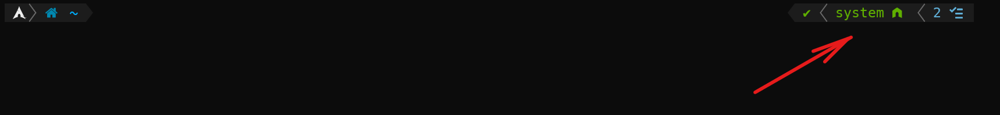
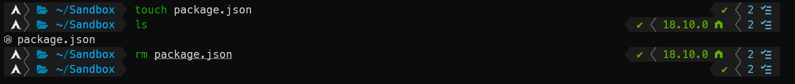

:: Part 3: The Node and Git Part > Node.js and NPM

---

> TODO: This document could be written better.

# Node.js and NPM

More than likely you are setting up this environemnt because you might be working on a [Node.js](https://nodejs.org/) (`node`) project.  

In that case, you will likely need to install Node.js and [Node Package Manager](https://www.npmjs.com/) (`npm`), and eventually [Yarn](https://yarnpkg.com/).
But we're not going to install Yarn just yet, especially since the `yarn` package that is in `pacman` is still a version 1.x package.

The `nodejs` package will install.
- `c-ares-1.18.1-1`
- `nodejs-18.10.0-1`

The `npm` package will install
- `node-gyp-9.1.0-1`
- `nodejs-nopt-6.0.0-1`
- `semver-7.3.7-1`
- `npm-8.19.2-1`

We just need to run these two lines

```
sudo pacman -S node					# Install Node.js
sudo pacman -S npm					# Install the node package manager
```

Or better yet, install them both at the same time.

```bash
sudo pacman -S node npm
```

Eventually, I will write something on how to install `yarn`. Be patient.

> TODO: Should I have installed Typescript here? What about Prettier?

### NVM: Node Veresion Manager

[Node Version Manager](https://github.com/nvm-sh/nvm) (`nvm`) is a version manager for Node.js, desiged to be installed per-user and invoked per-shell.

Because Node may use different version of Node on different proejcts, you may have several versions of Node. But that's no fun, and could take up a lot of space on your harddrive.

NVM is designed to fix this problem and works with any POSIX-compliant shell (including `bash` and `zsh`). This "per-project" environment set up fixes it.

We will need to add `nvm` from the NVM git repo. Fortunately, there is bash script that we can run using curl.

```bash
curl -o- https://raw.githubusercontent.com/nvm-sh/nvm/v0.39.1/install.sh | bash
```

This will download `nvm` and append these lines to the end of our `~/.zshrc` file.

> Note: If `bash` is still your default shell, this will be appended to `~/.bashrc`. If upgrade to `zsh`, you will need to copy these lines to the end of `~/.zshrc`.  I recommend you use `zsh` if you haven't set that up already.

```bash
export NVM_DIR="$HOME/.nvm"
[ -s "$NVM_DIR/nvm.sh" ] && \. "$NVM_DIR/nvm.sh"  # This loads nvm
[ -s "$NVM_DIR/bash_completion" ] && \. "$NVM_DIR/bash_completion"  # This loads nvm bash_completion
```

If you followed all of the instructions on this page, you likely installed a few global node packages and you may see this message.

```
=> You currently have modules installed globally with `npm`. These will no
=> longer be linked to the active version of Node when you install a new node
=> with `nvm`; and they may (depending on how you construct your `$PATH`)
=> override the binaries of modules installed with `nvm`:

/usr/lib
├── corepack@0.14.1
├── node-gyp@9.1.0
├── nopt@6.0.0
└── semver@7.3.8
=> If you wish to uninstall them at a later point (or re-install them under your
=> `nvm` Nodes), you can remove them from the system Node as follows:

     $ nvm use system
     $ npm uninstall -g a_module
```

I'm pretty sure this is nothing to worry about. (If I'm wrong, I'll edit this later.)  But you should be using [semantic versioning](https://semver.org/) on your projects anyway.

One thing that might happen is that if you have the `nvm` plugin enabled on Powerlevel10k you might see this when you restart ArchWSL even if your not in a folder that is hosting a node.

 

Since I didn't add a `nvm` plugin in `~/.zshrc`, this means that it was activated by Powerlevel10k because the it appears in the `POWERLEVEL9K_RIGHT_PROMPT_ELEMENTS` list in `~/.p10k.zsh`.

Apparently, [this should ONLY happen if the directory contains a `package.json` file](https://github.com/romkatv/powerlevel10k/issues/373).

To fix this, we need to go into the `~/p10k.zsh` file, go to the `POWERLEVEL9K_RIGHT_PROMPT_ELEMENTS` list and comment out  `nodeenv`, `nvm`, and `nodeenv`. We should also uncomment `node_version`, save the changes to the file, and restart ArchWSL. This should fix the problem.

Upon restarting after performing the fix, I ran a few tests in the `Sandbox` directory and verified that this was the solution.




---
[Up: Index](../00-START_HERE.md) &middot;
[Prev: Taskwarrior](../Part2/04-Taskwarrior.md) &middot;
[Next: Secure Shell](02-SSH.md)

